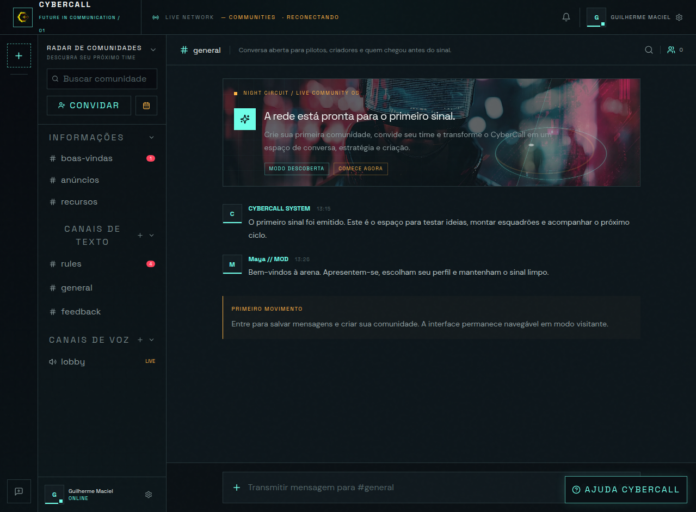

# CyberCall

[](https://github.com/GuilhermeADS13/CyberCall/actions/workflows/ci.yml) [](LICENSE)

CyberCall é uma plataforma social full-stack inspirada em comunidades em tempo real, com estética **Night Circuit** e foco em comunicação, moderação e chamadas de áudio/vídeo. O produto combina comunidades, canais, mensagens persistentes, DMs, convites de sala, sinalização WebSocket, WebRTC mesh e controles de mídia em uma interface responsiva cyberpunk.

> **Estado atual:** aplicação funcional em desenvolvimento, com autenticação Manus OAuth, persistência Drizzle/MySQL/TiDB, sincronização realtime e chamadas WebRTC em malha. O projeto ainda exige infraestrutura TURN para melhorar conectividade em redes restritivas e um scanner antimalware para liberar documentos e PDFs.

## Prévia visual



A imagem acima apresenta o shell Night Circuit em desktop. A experiência de voz/vídeo, medidor de microfone, destaque de fala e indicadores de rede aparecem dentro do overlay de chamada após autenticação e entrada em um canal de voz. Para acompanhar o código e os testes, consulte o [workflow CyberCall CI](.github/workflows/ci.yml).

## Funcionalidades

| Área | Implementação |
| --- | --- |
| Comunidades | Rail filtrável, comunidades, categorias recolhíveis, canais de texto e voz, busca, convites e estados de descoberta. |
| Mensagens | Histórico persistente, envio, edição e exclusão pelo autor, marcação de mensagem editada, reações, DMs e anexos de imagem. |
| Realtime | WebSocket autenticado em `/api/realtime`, inscrições isoladas por comunidade/canal/DM, reconexão, heartbeat, deduplicação e presença. |
| Voz e vídeo | Salas acessíveis, convites persistidos, sinalização WebRTC por offer/answer/ICE, captura de microfone/câmera, peers remotos e cleanup. |
| Mídia avançada | Compartilhamento de tela, troca de microfone/câmera, seleção de saída de áudio com `setSinkId` quando disponível e renegociação de tracks. |
| Indicadores | Medidor RMS do microfone, sensibilidade visual configurável, detecção de fala e destaque do participante ativo, qualidade de rede por peer. |
| Perfil | Avatar com recorte e zoom, presença Online/Ausente/Ocupado/Invisível, configurações acessíveis e persistência local das preferências. |
| Segurança | Autorização por autoria e comunidade, isolamento de signaling, allowlist de anexos, validação de assinatura, moderação visual e política fail-closed para documentos. |
| Assistente | CyberCall Assist com FAQ server-side para dúvidas sobre a plataforma. |
| Acessibilidade | Foco inicial em modais, Escape, ARIA, `aria-live`, labels de mídia, fallback sem Web Audio API e suporte a `prefers-reduced-motion`. |

## Stack

A aplicação usa React 19, Vite, Tailwind CSS 4, Express, tRPC 11, Drizzle ORM, MySQL/TiDB, Manus OAuth, Vitest, WebSocket (`ws`), WebRTC e AI SDK para o assistente. Arquivos enviados devem usar o fluxo de armazenamento S3 disponibilizado pelo template full-stack.

## Arquitetura

O frontend principal está em `client/src/pages/Home.tsx`, que compõe o shell da comunidade, chat, perfil, avatar editor e sala de voz/vídeo. O módulo `client/src/lib/realtime.ts` mantém a conexão WebSocket do navegador; `client/src/lib/webrtc.ts` gerencia peers, signaling, renegociação, métricas e streams; `client/src/lib/microphoneMeter.ts` mede volume RMS; e `client/src/lib/speechDetector.ts` identifica atividade de fala.

No servidor, `server/realtime.ts` implementa o hub WebSocket autenticado e roteia presença, mensagens e signaling somente para escopos autorizados. `server/routers.ts` contém os contratos tRPC e mutations persistentes. `server/db.ts` concentra helpers de dados e autorização. O endpoint HTTP de realtime é registrado no mesmo servidor que atende OAuth, tRPC, uploads e Vite.

## Execução local

Pré-requisitos: Node.js 22 ou compatível, pnpm, credenciais de ambiente do template Manus e uma instância MySQL/TiDB para os recursos persistentes.

```bash
pnpm install
pnpm check
pnpm test --run
pnpm build
pnpm dev
```

O servidor de desenvolvimento não deve ter uma porta fixa hardcoded; o ambiente Manus injeta a porta compatível com o projeto. Para autenticação, configure as variáveis do template, incluindo `DATABASE_URL`, `JWT_SECRET`, `VITE_APP_ID`, `OAUTH_SERVER_URL`, `VITE_OAUTH_PORTAL_URL` e as variáveis do Forge integradas ao projeto. Não versione `.env`, tokens ou credenciais.

## Realtime e WebRTC

O canal WebSocket usa autenticação por cookie de sessão e fallback Bearer para previews em que cookies podem não estar disponíveis. Eventos de mensagem são entregues somente ao canal assinado; eventos de comunidade carregam presença, e eventos de voz são direcionados por `roomKey` e `targetUserId`.

A chamada atual utiliza topologia mesh: cada participante cria conexões peer-to-peer com os demais. A qualidade é estimada periodicamente com `RTCPeerConnection.getStats()`, considerando RTT, perda de pacotes e estado da conexão. Para produção em redes corporativas, móveis ou com NAT restritivo, recomenda-se adicionar servidores TURN e, para grupos maiores, migrar a topologia para SFU.

## Política de uploads e segurança

Imagens passam por allowlist de MIME/extensão, limite de tamanho, sanitização de nome, validação de assinatura e moderação visual antes de serem exibidas. Documentos e PDFs continuam bloqueados por política fail-closed até que um scanner antimalware seja configurado. A integração futura prevista usa `CLOUDMERSIVE_API_KEY`; a credencial não deve ser colocada no código nem no repositório.

As permissões de mensagens são author-only para edição e exclusão. O signaling verifica autenticação, membership e escopo de sala antes de encaminhar offers, answers e ICE. Qualquer expansão de permissões administrativas deve preservar o papel de moderador/admin e os registros de auditoria planejados.

## Testes e validação

A suíte Vitest cobre autenticação, navegação, responsividade, comunidades, mensagens, anexos, moderação, presença, WebSocket, signaling, WebRTC, medidor de microfone, detector de fala e notificações. A validação mais recente registrou **53 testes passando**, 1 teste antimalware ignorado, `pnpm check` sem erros e build de produção concluído. O build ainda apresenta um aviso preexistente de chunks grandes relacionado ao assistente e dependências de visualização.

As revisões visuais estão documentadas em `network-quality-visual-review.md`, `speaking-indicator-visual-review.md`, `microphone-sensitivity-visual-review.md` e nos demais registros de mídia. Esses arquivos apoiam a validação, mas não substituem o teste de uma chamada real com dois navegadores e permissões de câmera/microfone.

## Próximos passos

A evolução recomendada é persistir avatar, presença e nome de exibição no banco; adicionar TURN e SFU; implementar compartilhamento de áudio do sistema; ativar scanner antimalware para documentos; criar auditoria persistente de moderação; e adicionar observabilidade de conexões, RTT, perda e falhas de signaling em produção.

## Licença

O repositório mantém a licença MIT existente. Consulte `LICENSE` para os termos completos.
